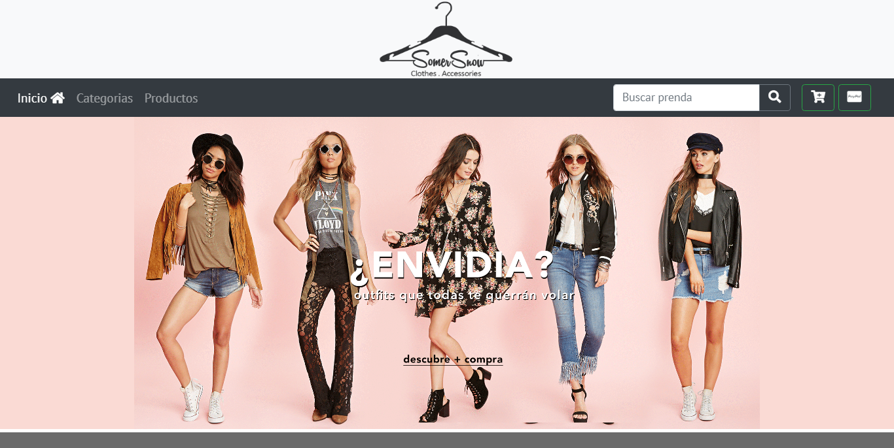
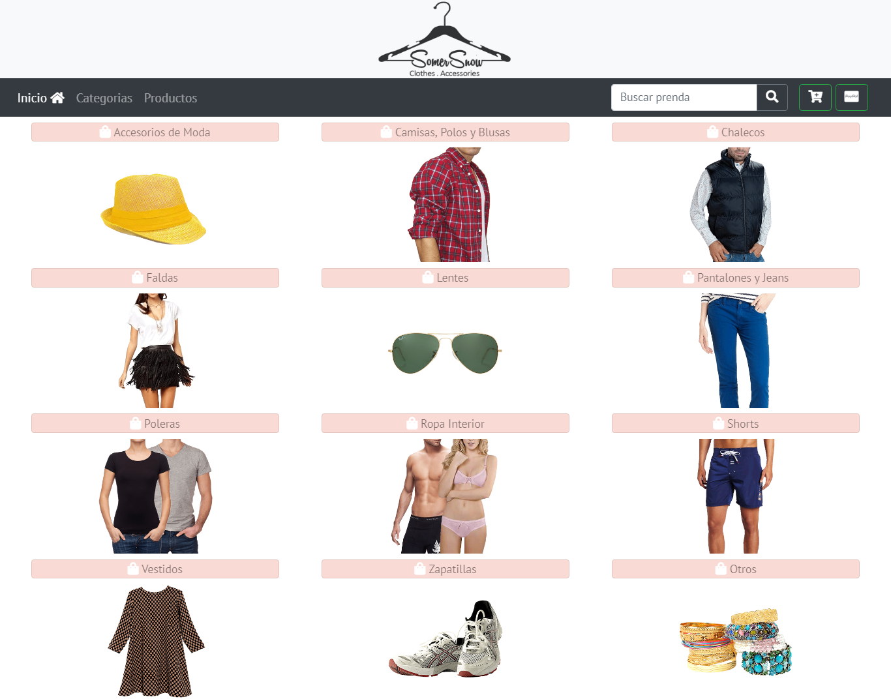
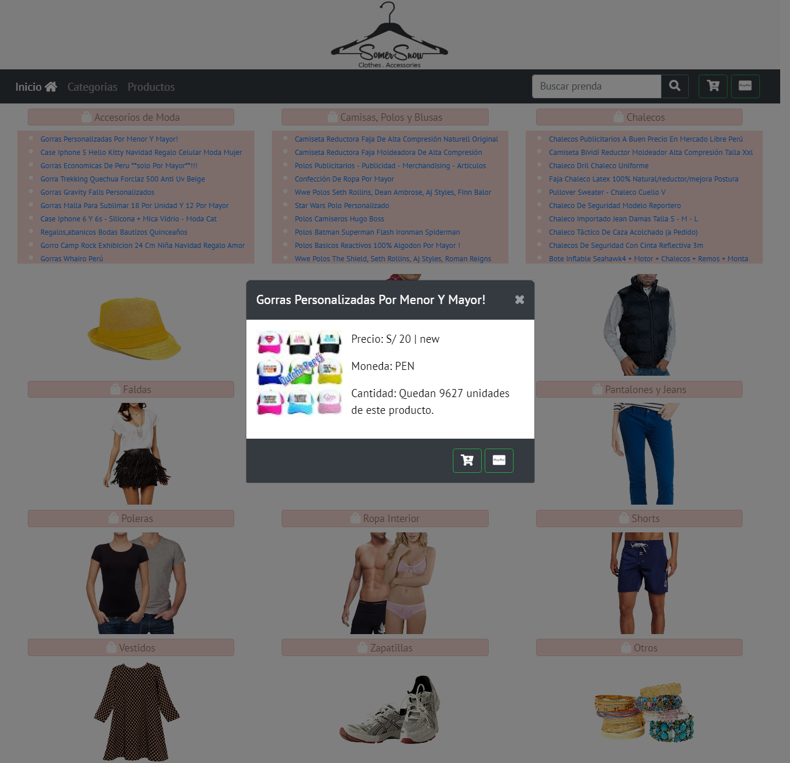

# E-commerce COTHES

* **Track:** _Especialización Front-end_
* **Curso:** _CONSTRUYE UNA SINGLE PAGE APP (SPA) MULTI-USUARIO CONSUMIENDO DATA REMOTA_
* **Unidad:** _Producto final_
* **Desarrolladoras:** _Dayam Llerema y Margarita Sutta._

***

E-commerce COTHES, es una app web basado bajo los principios de SPA (Single page aplication). Para ello se aplicaron conceptos nuevos en la cuales detallaremos mas a delante.

 
 
  
***

## Requisitos

El reto consiste en incluir incluir lo siguiente:

1. `Templating` son las vistas que se encuentran en la carpeta views.
2. `Routing (URLs)` se genero un archivo routes.js.
3. `DOM & Event Handling (State)`.
4. `Patrón de arquitectura de software (MV*)` - Modelo/Vista/Controlador.

***

## Herramientas a utilizar

1. HTML 5
2. CSS3
3. Bootstrap
4. Javascript
5. Angular 1.6.9
6. API Mercado libre - sin generar token.
7. API de Paypal - para pasarela de pagos

***
